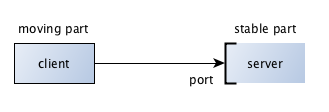
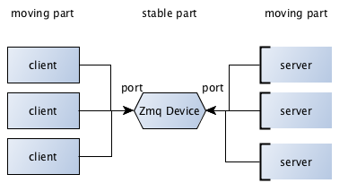

ØMQ Devices
======================

You must have noticed that you can bind a port to any of the ZMQ Socket types.
In example for Push/Pull pattern, we bound ZMQ.PUSH (producer) and ZMQ.PULL (result collector) to well known ports.

In theory, most stable part of the network (server) will BIND on a specific port and have the more dynamic parts (client) CONNECT to that.

    
Some time both ends can be dynamic and it is not a good idea to provide well known ports to either of the ends.

In such cases, you could connect them using zeromq’s forwarding device. 
These devices can bind to 2 different ports and forward messages from one end to the other. 
The forwarding device can become the stable point in your network where each component can connect to.

    
ZMQ provides certain basic devices to build complex topology with basic patterns:

.. toctree::
   :maxdepth: 2
   
   Queue <queue.rst>
   Forwarder <forwarder.rst>
   Streamer  <streamer.rst>
   
   
   
   
