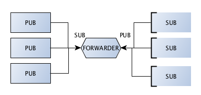

Forwarder
====================

.. topic:: Forwarder device

    Just like QUEUE, which is like the request-reply broker, FORWARDER is like the pub-sub proxy server.
    It allows both publishers and subscribers to be moving parts and it self becomes the stable hub for interconnecting them.

    FORWARDER collects messages from a set of publishers and forwards these to a set of subscribers.
    

You will notice that two zmq sockets, pub and sub are bound to well known ports.
The frontend speaks to publishers and the backend speaks to subscribers. 
You should use ZMQ_FORWARDER with a ZMQ_SUB socket for the frontend and a ZMQ_PUB socket for the backend.

Another important thing to notice is that we want all the published messages to reach to the various subscribers, 
hence message filtering should be off in the forwarder device. See line no 11.

**forwarder_device.py**

.. literalinclude:: code/forwarder_device.py
    :emphasize-lines: 8-9,11,14-15,17
    
Only thing that changes here is that publisher connects to the intermediary and is not bound to any well known port.
    
**forwarder_server.py**

.. literalinclude:: code/forwarder_server.py
    :emphasize-lines: 9
    
The subscribers are completely unaffected by introduction of intermediary - "forwarder device" and gains the ability to
get messages from different publishers at no cost.
    
**forwarder_subscriber.py**

.. literalinclude:: code/forwarder_subscriber.py
    :emphasize-lines: 9
    
Executing these programs from separate shell::

    python forwarder_device.py
    python forwarder_subscriber.py
    python forwarder_server.py
    python forwarder_server.py
    
Output on the subscriber::

    Collecting updates from server...
    9 server#3581
    9 server#9578
    9 server#3581
    9 server#9578
    9 server#3581
    9 server#9578
    9 server#3581
    9 server#3581
    9 server#9578
    9 server#3581

   