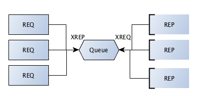

Queue
====================

.. topic:: Queue device

    This is the intermediary that sits between clients and servers, forwarding request to servers and relaying replies back to client.
    The ZMQ device takes a device type (ZMQ.QUEUE) and the two sockets bound to well known ports. 

**queue_device.py**

.. literalinclude:: code/queue_device.py
    :emphasize-lines: 8-9,11-12,14
    
.. Note::

    ZMQ devices are full programs, devices include a while(True) loop and thus block execution permanently once invoked.
    
Here, you can see that client has not changed at all from our previous example by introduction of an intermediary ZMQ device.
    
**queue_client.py**

.. literalinclude:: code/queue_client.py
    :emphasize-lines: 9
    
Here, the only change to the server is that it is not bound to a well known port. Instead it connects to a well known port of the intermediary. 

**queue_server.py**

.. literalinclude:: code/queue_server.py
    :emphasize-lines: 9
    
Execute the following on different shells::

    python  queue_device.py
    python queue_server.py
    python queue_server.py
    python queue_client.py
    python queue_client.py
    
If you run a single client, you can see that requests are load balanced among available server::

    Connecting to server...
    Sending request  1 ...
    Received reply  1 [ World from server 7003 ]
    Sending request  2 ...
    Received reply  2 [ World from server 4411 ]
    Sending request  3 ...
    Received reply  3 [ World from server 7003 ]
    Sending request  4 ...
    Received reply  4 [ World from server 4411 ]
    Sending request  5 ...
    Received reply  5 [ World from server 7003 ]
    Sending request  6 ...
    Received reply  6 [ World from server 4411 ]
    Sending request  7 ...
    Received reply  7 [ World from server 7003 ]
    Sending request  8 ...
    Received reply  8 [ World from server 4411 ]
    Sending request  9 ...
    Received reply  9 [ World from server 7003 ]
    
 
    
        