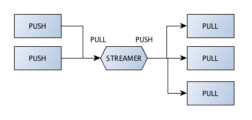

Streamer
====================

.. topic:: Streamer device

    is a device for parallelized pipeline messaging. 
    Acts as a broker that callects tasks from task feeders and supplies them to task workers.
    
    

**streamer_device.py**

.. literalinclude:: code/streamer_device.py
    :emphasize-lines: 8-9,12-13,15
    

**task_feeder.py**

.. literalinclude:: code/task_feeder.py
    :emphasize-lines: 6-7
    

**task_worker.py**

.. literalinclude:: code/task_worker.py
    :emphasize-lines: 11-12
    

Execute these programs on separate shells::

    python streamer_device.py
    python task_feeder.py
    python task_worker.py
    python task_worker.py
    

Output on one of the workers::

    I am consumer #8113
    {'num': 1, 'consumer': 8113}
    {'num': 3, 'consumer': 8113}
    {'num': 5, 'consumer': 8113}
    {'num': 7, 'consumer': 8113}
    {'num': 9, 'consumer': 8113}
    {'num': 11, 'consumer': 8113}

    

