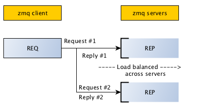

Client / Server
====================================

.. topic:: Request/Reply pattern

    Most basic pattern is client/server model, where client sends a request and server replies to the request.
    
There is one difference from zmq.PAIR and other type of ZMQ sockets. 

* ZMQ REQ sockets can connect to many servers.
* The requests will be interleaved or distributed to both the servers.

With socket zmq.PAIR, you could send any number of messages among connected peers or client/server.

* socket zmq.REQ will block on send unless it has successfully received a reply back.
* socket zmq.REP will block on recv unless it has received a request.

Each Request/Reply is paired and has to be successful.

**reqrep_server.py**

Provide port as command line argument to run server at two different ports. 

.. literalinclude:: code/reqrep_server.py
    :lines: 1-9
    :emphasize-lines: 5-8
    
**Server** is created with a socket type "**zmq.REP**" and is bound to well known port.

.. literalinclude:: code/reqrep_server.py
    :lines: 9-12
    :emphasize-lines: 2-3

It will block on recv() to get a request before it can send a reply.    

.. literalinclude:: code/reqrep_server.py
    :lines: 12-
    :emphasize-lines: 5,8

**reqrep_client.py**

Provide two ports of two different servers to connect to simultaneously. 

.. literalinclude:: code/reqrep_client.py
    :lines: 1-12
    :emphasize-lines: 4-11

**Client** is created with a socket type "**zmq.REQ**". 
You should notice that the same socket can connect to two different servers.

.. literalinclude:: code/reqrep_client.py
    :lines: 13-19
    :emphasize-lines: 4,6

You have to send a request and then wait for reply.    

.. literalinclude:: code/reqrep_client.py
    :lines: 19-
    :emphasize-lines: 4,6    

Executing the scripts::

    python reqrep_server.py 5546
    python reqrep_server.py 5556
    python reqrep_client.py 5546 5556
    
Output::

    Connecting to hello world server...
    Sending request  1 ...
    Received reply  1 [ World from 5556 ]
    Sending request  2 ...
    Received reply  2 [ World from 5546 ]
    Sending request  3 ...
    Received reply  3 [ World from 5556 ]
    Sending request  4 ...
    Received reply  4 [ World from 5546 ]
    Sending request  5 ...
    Received reply  5 [ World from 5556 ]
    Sending request  6 ...

 
Any attempt to send another message to the socket (zmq.REQ/zmq.REP), without having received a reply/request will result in an error::

    ....
    socket.send ("Hello")
    socket.send ("Hello1")
    ....

    Error: zmq.core.error.ZMQError: Operation cannot be accomplished in current state

.. note::

    If you kill the server (Ctrl-C) and restart it, the client won't recover properly. 
    

