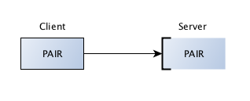

PAIR
===========

It provides sockets that are close in behavior to conventional sockets.

Conventional sockets allow:

* only strict one-to-one (two peers)
* many-to-one (many clients, one server)
* one-to-many (multicast) relationships

.. topic:: Exclusive pair pattern

    Paired sockets are very similar to regular sockets.
    
    * The communication is bidirectional.
    * There is no specific state stored within the socket
    * There can only be one connected peer.
    * The server listens on a certain port and a client connects to it. 

    
What this really shows is the simplicity of setup and the fact that you receive the complete message that was sent.
There is no need to think whether you have read the complete message or not.

**pairserver.py**

.. literalinclude:: code/pairserver.py
    :emphasize-lines: 8-10
    :linenos:

**pairclient.py**

.. literalinclude:: code/pairclient.py
    :emphasize-lines: 8-10,14-15
    :linenos:

running it::

    python pairserver.py <port>
    python pairclient.py <port>
    

 

Each of them can send any number of messages to each other.

   
   
             
