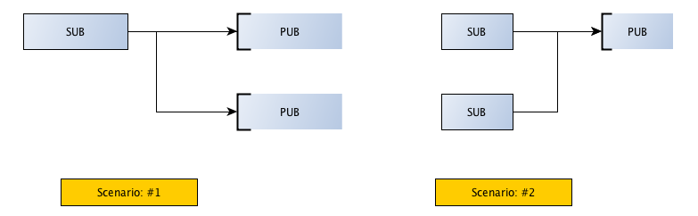

Publish/Subscribe
============================

.. topic:: Pub/Sub pattern

    Publish/Subscribe is another classic pattern where senders of messages, called publishers, 
    do not program the messages to be sent directly to specific receivers, called subscribers. 
    Messages are published without the knowledge of what or if any subscriber of that knowledge exists.

Scenario #2 is more known, general pattern where multiple subscribers subscribes to messages/topics being published by a publisher.
It is scenario #1 which is more interesting. Just like ZMQ.REQ which can connect to multiple ZMQ.REP, ZMQ.SUB can connect to multiple ZMQ.PUB (publishers).
No single publisher overwhelms the subscriber. The messages from both publishers are interleaved.

    
**pub_server.py**

Publishers are created with ZMQ.PUB socket types    

.. literalinclude:: code/pub_server.py
    :lines: 1-14
    :emphasize-lines: 12  

Data is published along with a topic. The subscribers usually sets a filter on these topics for topic of their interests.  

.. literalinclude:: code/pub_server.py
    :lines: 15-21
    :emphasize-lines: 5
 

**sub_client.py**

Subscribers are created with ZMQ.SUB socket types.    
You should notice that a zmq subscriber can connect to many publishers.

.. literalinclude:: code/sub_client.py
    :lines: 1-22
    :emphasize-lines: 15,18,21

The current version of zmq supports filtering of messages based on topics at subscriber side.
This is usually set via socketoption.

.. literalinclude:: code/sub_client.py
    :lines: 23-
    :emphasize-lines: 3

Pub/Sub communication is asynchronous. If a "publish" service has been started already and then when you start "subscribe" service, 
it would not receive a number of message that was published already by the pub services.
Starting "publisher" and "subscriber" is independent of each other.
 
A subscriber can in fact connect to more than one publisher, using one 'connect' call each time. 
Data will then arrive and be interleaved so that no single publisher drowns out the others.::

    python pub_server.py 5556
    python pub_server.py 5546
    python sub_client.py 5556 5546
    

Other things to note:

* A publisher has no connected subscribers, then it will simply drop all messages.
* If you're using TCP, and a subscriber is slow, messages will queue up on the publisher.
* In the current versions of ØMQ, filtering happens at the subscriber side, not the publisher side.
    
 

