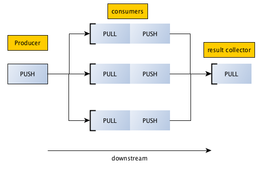

Push/Pull
=====================

.. topic:: Pipeline pattern

    Push and Pull sockets let you distribute messages to multiple workers, arranged in a pipeline.
    A Push socket will distribute sent messages to its Pull clients evenly.
    This is equivalent to producer/consumer model but the results computed by
    consumer are not sent upstream but downstream to another pull/consumer socket.
    
    Data always flows down the pipeline, and each stage of the pipeline is connected to at least one node. 
    When a pipeline stage is connected to multiple nodes data is load-balanced among all connected nodes.
    

    

    
**producer.py**

Producers are created with ZMQ.PUSH socket types. Producer is bound to well known port to which consumers can connect too.    

.. literalinclude:: code/producer.py
    :lines: 1-14
    :emphasize-lines: 6,7
    

**consumer.py**

Producers are created with ZMQ.PULL socket types to pull requests from producer and uses a push socket to connect and push result to result collector.  

.. literalinclude:: code/consumer.py
    :lines: 1-24
    :emphasize-lines: 10,11,13,14
    

    
**resultcollector.py**

result collector are created with ZMQ.PULL socket type and act as consumer of results from intermediate consumers.
They also are bound to well known port so that intermediate consumer can connect to it.

.. literalinclude:: code/resultcollector.py
    :lines: 1-20
    :emphasize-lines: 7,8
    

We have to execute the programs on separate shells as all programs have a while loop that we will discard later::

    python resultcollector.py
    python consumer.py
    python consumer.py
    python producer.py
    
Results shows the distribution of transmitted result to result collector::

    {   3362: 233, 
        9312: 767
    }
    

    
