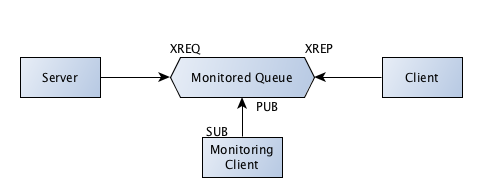

Monitor Queue 
============================

**monitoredqueue.py**

MonitoredQueue allows you to create a Queue device. The messages in/out of the queue are published on a third socket.

.. literalinclude:: code/monitoredqueue.py
    :lines: 1-13
    :emphasize-lines: 4-5

MonitoredQueue accepts in/out socket type (type and not socket) like a typical ØMQ device.
It also accepts a third socket types which conveniently can be a zmq.PUB  type. 
This allows the communication on in/out socket to be published on a third socket for monitoring purposes.

Also you should read the following: `pyzmq and unicode <http://zeromq.github.com/pyzmq/unicode.html#what-this-means-for-pyzmq>`_.
As it says, PyZMQ is a wrapper for a C library and you should be passing in bytes and not string which in python 3 would be unicode strings.
We will correct some of our examples later on for this purpose.

.. literalinclude:: code/monitoredqueue.py
    :lines: 14-27
    :emphasize-lines: 2-4,8,12
    
This is a simple server that receives a request and sends a reply.

.. literalinclude:: code/monitoredqueue.py
    :lines: 28-38
    :emphasize-lines: 4-5
    
This is a simple client that sends a request, receives and prints the reply.
    
.. literalinclude:: code/monitoredqueue.py
    :lines: 39-49
    :emphasize-lines: 4-5
    
This is a monitoring client that connects to the publisher socket in the device and publishes the monitoring information.

.. literalinclude:: code/monitoredqueue.py
    :lines: 50-60
    :emphasize-lines: 4-5  
    
Here we just start device, server, client and monitoring clients as separate process.  

.. literalinclude:: code/monitoredqueue.py
    :lines: 61-76
    :emphasize-lines: 1-2,4-5   

Output::

    Program: Server connecting to device
    Starting monitoring process
    Collecting updates from server...
    Program: Worker #0 connecting to device
    Program: Worker #1 connecting to device
    Server: Received - Request #1 from client#0
    Monitoring Client: ['in', '\x00\xcb\xc5J9<$E9\xac\xf6\r:\x82\x92EU', '', 'Request #1 from client#0']
    Monitoring Client: ['out', '\x00\xcb\xc5J9<$E9\xac\xf6\r:\x82\x92EU', '', 'Response from server #4431']
    Client: Received - ['Response from server #4431']
    Server: Received - Request #1 from client#1
    Monitoring Client: ['in', "\x00\r'C\x0f\xf6TO\x84\xbe\xe3\x85\xf6(\x07<\xab", '', 'Request #1 from client#1']
    Client: Received - ['Response from server #4431']
    Monitoring Client: ['out', "\x00\r'C\x0f\xf6TO\x84\xbe\xe3\x85\xf6(\x07<\xab", '', 'Response from server #4431']

