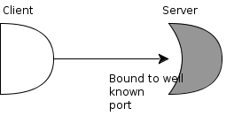
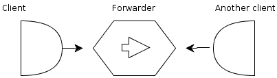
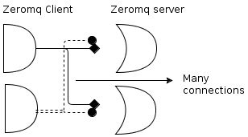
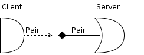
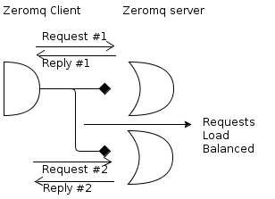
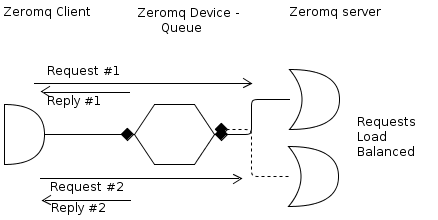
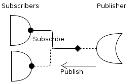
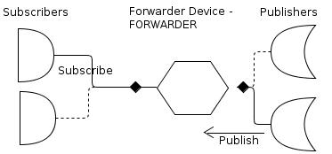
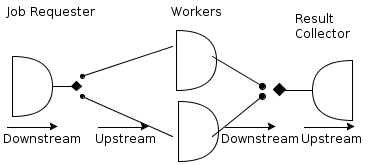
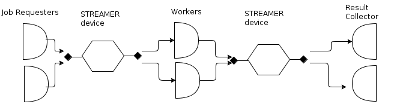

Conceptual understanding of ZeroMQ
=============================================

Three step approach to implementing ZeroMQ:

1. Choose a transport
2. Set up the infrastructure
3. Select a messaging pattern 

transport
----------------

ZeroMQ provides 4 different transports:

1. **INPROC** an In-Process communication model
2. **IPC** an Inter-Process communication model
3. **MULTICAST** multicast via PGM, possibly encapsulated in UDP
4. **TCP** a network based transport

For communications within the machines, INPROC & IPC should be the sufficient mechanism.
For communications across machines, MULTICAST & TCP are the choices.

infrastructure
------------------------

Most stable part of the network (server) will BIND on a specific port and have the more dynamic parts (client) CONNECT to that.

Some time both ends can be dynamic. In such cases, you could connect them using zeromq's forwarding device.
These devices can bind to 2 different ports and forward messages from one end to the other.
the forwarding device can become the stable point in your network where each component can connect to. 

    

0mq vs conventional sockets
~~~~~~~~~~~~~~~~~~~~~~~~~~~~~~~~~

Important differences with conventional sockets and zeromq sockets is that 
a conventional client can connect to only a single conventional server while a zeromq client can connect to many zeromq servers.
This allows a many to many relationship.

forwarders
~~~~~~~~~~~~~~~~~~~~

ZeroMQ provides three types of forwarder:

1. **QUEUE**, a forwarder for the request/response messaging pattern
2. **FORWARDER**, a forwarder for the publish/subscribe messaging pattern
3. **STREAMER**, a forwarder for the pipelined messaging pattern

message pattern
------------------------

After defining the infrastructure (zeromq devices), one must choose the pattern of message flow to use.

The patterns that 0MQ supports are:

1. **REQUEST/REPLY**, bidirectional, load balanced and state based
2. **PUBLISH/SUBSCRIBE**, publish to multiple recipients at once
3. **PUSH/PULL**, distribute data to nodes arranged in a pipeline
4. **PAIR**, communication exclusively between peers

PAIR
~~~~~~~~~~~~~

Paired sockets are very similar to regular sockets as the communication is bidirectional, 
there is no specific state stored within the socket and there can only be one connected peer.
The server listens on a certain port and a client connects to it. This pattern is also called *Exclusive pair pattern*.

An example use would be:

* Inter-thread communication across the inproc transport.

A socket of type ZMQ_PAIR can only be connected to a single peer at any one time. 
No message routing or filtering is performed on messages sent over a ZMQ_PAIR socket.

REQUEST/REPLY
~~~~~~~~~~~~~~~~~~~~~~

The request-reply pattern is used for sending requests from a client to one or more instances of a service, 
and receiving subsequent replies to each request sent.

A socket of type **ZMQ_REQ** is used by a client to send requests to and receive replies from a service. 
This socket type allows only an alternating sequence of zmq_send(request) and subsequent zmq_recv(reply) calls.
The requests are load balanced among many service connections that are available.
Key interfaces: zmq_send(request), zmq_recv(reply)

A socket of type **ZMQ_REP** is used by a service to receive requests from and send replies to a client.
Key interfaces: zmq_recv(request), zmq_send(reply)

ZeroMQ will automatically balance requests over the different peers.
In the above topology, client has to be aware of multiple servers, which is not a good idea. 
Using a zeromq forwarder device removes this issue.

    
In this topology, both servers and clients can connect to well known ports of the *forwarder device* called *Queue*. 
Instead of having the clients connect directly to multiple servers it can connect to a single forwarding device. 
The forwarding device will then reroute all messages to the connected servers.

ZMQ_QUEUE creates a shared queue that collects requests from a set of clients, and distributes these fairly among a set of services. 
Requests are fair-queued from frontend connections and load-balanced between backend connections. 
Replies automatically return to the client that made the original request.

DEALER/ROUTER
~~~~~~~~~~~~~~~~~~~~~~~

PUBLISH/SUBSCRIBE
~~~~~~~~~~~~~~~~~~~~~~~~
Publish–subscribe is a messaging pattern where senders of messages, called publishers, do not program the messages to be sent directly to specific receivers, called subscribers.
Messages are published without the knowledge of what or if any subscriber of that knowledge exists.
In a pub/sub pattern the components are loosely coupled. It helps you to scale out as there is no need to worry about the subscribers.

Two side effects are:

1. Delivery cannot be confirmed
2. Publisher will not know if the subscriber of that message has died and no longer consuming the messages published by server.

A socket of type ZMQ_PUB is used by a publisher to distribute data.
A socket of type ZMQ_SUB is used by a subscriber to subscribe to data distributed by a publisher. 
Initially a ZMQ_SUB socket is not subscribed to any messages, use the ZMQ_SUBSCRIBE option

Again like above, the subscribers connect to a single publisher. If you want multiple publishers then you can use the zeromq forwarder device.
Forwarder is a forwarder for the publish/subscribe messaging pattern.

    
ZMQ_FORWARDER collects messages from a set of publishers and forwards these to a set of subscribers. You will generally use this to bridge networks.

PUSH/PULL 
~~~~~~~~~~~~~~~~~

This is also called the "**Pipeline**" pattern. The earlier pattern alias "UPSTREAM/DOWNSTREAM" is deprecated.

The pipeline pattern is used for distributing data to nodes arranged in a pipeline. 
Data always flows down the pipeline, and each stage of the pipeline is connected to at least one node. 
When a pipeline stage is connected to multiple nodes data is load-balanced among all connected nodes.

    
It is similar to the Rep/Req pattern, the difference is that instead of requiring a reply being sent to the requester 
the reply can be pushed down the pipe or sent downstream.

A socket of type ZMQ_PUSH is used by a pipeline node to send messages to downstream pipeline nodes. 
Messages are load-balanced to all connected downstream nodes.

A socket of type ZMQ_PULL is used by a pipeline node to receive messages from upstream pipeline nodes. 
Messages are fair-queued from among all connected upstream nodes.

What about the case where, you want to collect tasks from a set of requesters and forward the results to set of collectors.
Streamer device helps you in doing that.

ZMQ_STREAMER collects tasks from a set of pushers and forwards these to a set of pullers. 
The front-end speaks to pushers and the backend speaks to pullers. 
You should use ZMQ_STREAMER with a ZMQ_PULL socket for the front-end and a ZMQ_PUSH socket for the backend.

